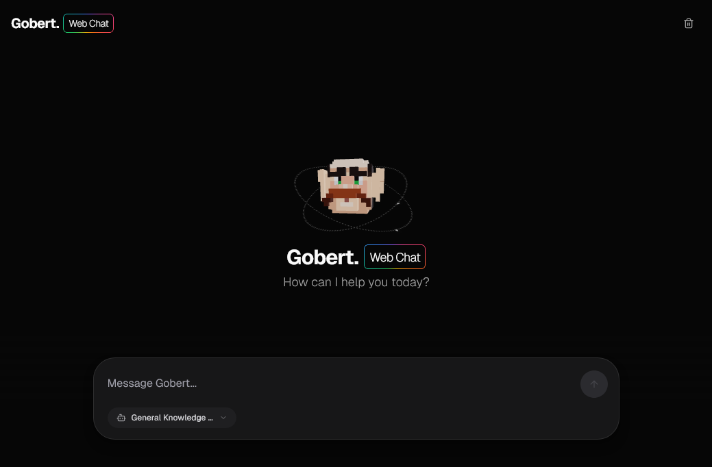
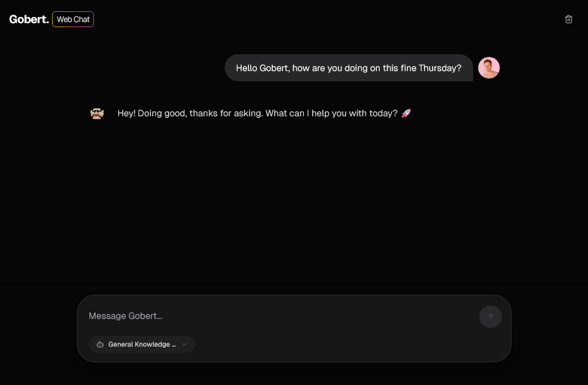

<div align="center">


# GobertUI
### A Clawdbot Web Chat Interface


A modern, immersive AI chat interface built with Next.js, Tailwind CSS, and React Three Fiber. <br />
Designed to interface with a local or remote Clawdbot instance.

</div>

## Screenshots

<div align="center">
  
  
</div>

## Features

-   **Immersive 3D Avatar**: Fully interactive 3D floating head avatar using React Three Fiber (import any .obj model file).
-   **Dynamic Animations**: Orbiting electron animations, animated borders, and gaze tracking.
-   **Real-time Communication**: WebSocket-based chat with streaming responses.
-   **Modern UI**: Sleek, dark-mode interface built with shadcn/ui and Tailwind CSS.
-   **Docker Support**: Full Docker and Docker Compose support for easy deployment.
-   **Agent Capabilities**: Plug and play support for all your Clawdbot agents.

## Prerequisites

-   Node.js (v18+)
-   A running instance of Clawdbot.

## Getting Started

### Local Development

1.  **Install dependencies:**

    ```bash
    npm install
    ```

2.  **Configure Environment:**
    
    Create a `.env.local` file (optional if using defaults):

    ```env
    CLAWDBOT_URL=ws://localhost:18789
    CLAWDBOT_GATEWAY_TOKEN=your-gateway-token-here
    NEXT_PUBLIC_BOT_NAME=your-bot-name-here
    NEXT_PUBLIC_BOT_HEAD=your-model.obj # Models sourced from public folder
    ```

3.  **Run the development server:**

    ```bash
    npm run dev
    ```

4.  **Open the app:**

    Navigate to [http://localhost:3123](http://localhost:3123).

### Using Docker

1.  **Build and Run with Docker Compose:**

    ```bash
    docker-compose up --build
    ```

    The app will be available at [http://localhost:3123](http://localhost:3123). If your Clawdbot instance/gateway is running on the same host, it should work out of the box. If not, you will need to update the `CLAWDBOT_URL` environment variable.

## Tech Stack

-   **Framework**: Next.js 16+ (App Router)
-   **Language**: TypeScript
-   **Styling**: Tailwind CSS, Tailwind Animate
-   **3D Graphics**: React Three Fiber, Dre
-   **UI Components**: shadcn/ui, Radix UI
-   **Icons**: Lucide React
-   **Runtime**: Node.js

## Contributions

Feel free to submit a PR!
